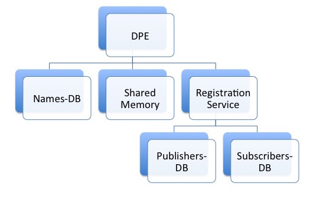
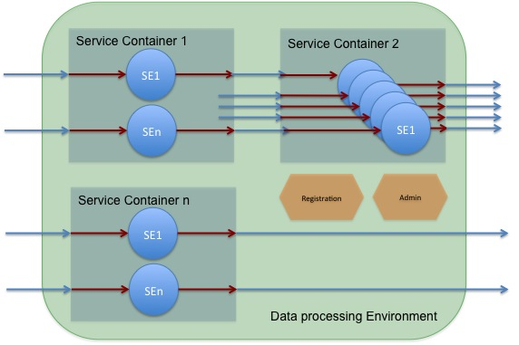
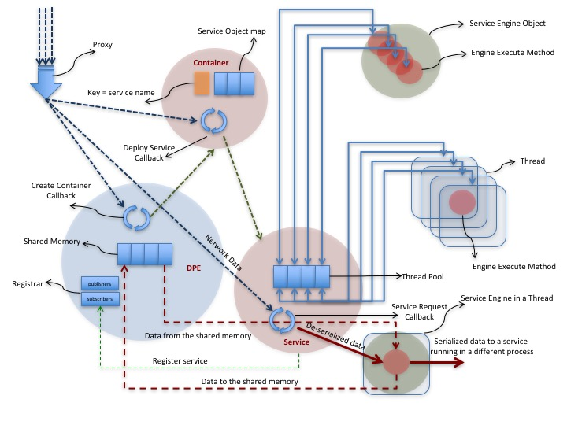
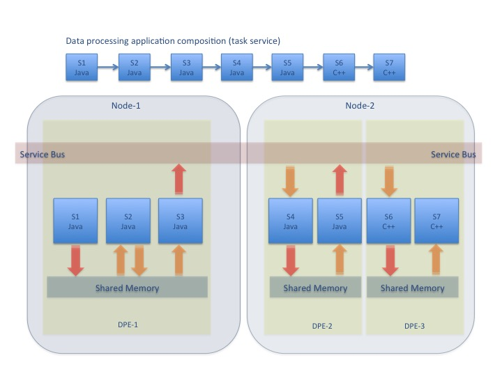
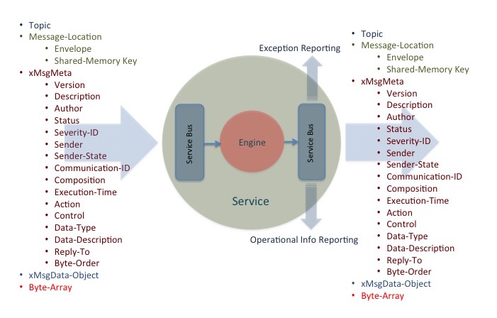
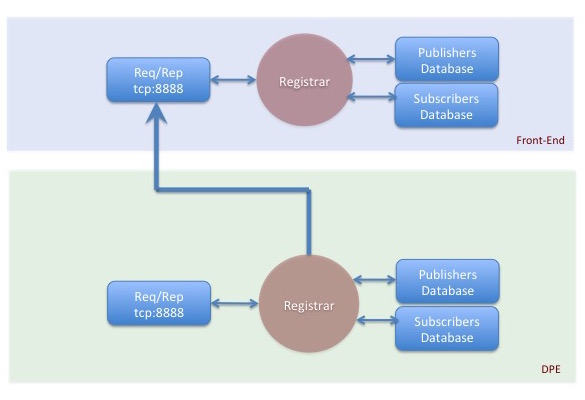
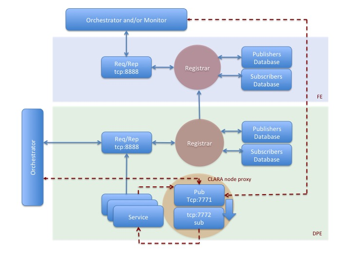
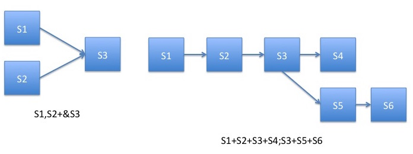
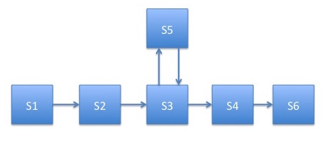

# Framework

## Programming paradigm

Software systems, including scientific data processing applications have a distinct 
component based structure. Most data processing and data mining applications are divided 
into more or less autonomous cooperating software units, cooperating to achieve data processing 
goals. So, by considering science data processing application as an organization of cooperating 
autonomous components, we can potentially improve SDP application agility in terms of deployment, 
customization, distribution, and scalability. 
Software systems component-based approach is important simply because it adds a unique 
value through simplifying the complexity in systems. By breaking apart a data processing 
application into smaller parts, we demonstrate ways of reducing duplication, increasing 
cohesion, and lowering coupling between parts, thus making overall system parts easier to 
understand, more mobile, scalable, and easier to change. 

The CLARA framework uses a micro-services architecture
to enhance the efficiency, agility, and productivity of data processing activities.
Services are the primary means through which data processing logic is implemented.
Data processing applications, developed using the CLARA framework,
consist of services running in a context that is agnostic
to the global data processing application logic.
Services are loosely coupled and can participate in multiple algorithmic compositions.
Legacy processes or applications can be presented as services
and integrated into a data processing application.
Services can be linked together and presented as one, complex, composite service.
This framework provides a federation of services,
so that service-based data processing applications can be united
while maintaining their individual autonomy and self-governance.

It is important to mention that CLARA makes a clear separation
between the service programmer and the data processing application designer.
An application designer can be productive by designing and composing data processing applications
using available, efficiently and professionally written software services
without knowing service programming technical details.
Services usually are long-lived and are maintained and operated by their owners
on distributed CLARA service containers.
This approach provides an application designer the ability to modify data processing applications
by incorporating different services in order to find optimal operational conditions,
thus demonstrating the overall agility of the CLARA framework.

## Services and service interactions

Message passing is the most popular communication model for distributed computing.
It is the key for building SOA-based frameworks.
This model is attractive due to the fact that messaging does not emulate
the syntax of programming language method or function calls (unlike RPC for example).
Instead, structured data messages are passed between distributed components (i.e. services).
In this distributed communication model success largely depends on the clever design of the message structure:
a communication envelope that describes not only transferred data but also communication and service operational details.
In order for a service communication to be truly useful,
every party has to share/use the same vocabulary for expressing the communication details
(i.e. common message-interface).

The CLARA framework provides developers with the means
for interacting with services based on the publish-subscribe message exchanges.
But such explicit interactions, where a service invokes operations
exported by the predefined interface of a well-known target service,
are only one piece of the messaging puzzle.
To make this clear,
consider a persistency service that converts CLARA transient data into a ROOT tree.
Using CLARA tools one can link for example
a charge particle tracking service to a ROOT persistency service
for storing reconstruction results in a ROOT format.
In this particular scenario,
the persistency service (i.e. invocation target) is known in advance
and the responsibilities between the requester service and the provider service
are defined in a service contract.
But that same messaging strategy is far less suitable for indicating event occurrences,
for example an IO exception detected by the persistency service.
In such situations, the developer of the persistency service
either does not know who is interested in the event,
or is not willing to hard-code the event handling logic in the service.
Indeed, doing so would increase its complexity
and reduce its reusability and maintainability.
What CLARA provides for such cases is a way to deliver event notification
to services or application orchestrators that register their interest in one or more events.
This is possible due to the CLARA message envelope design
(service communication message structure)
that contains event notification.

CLARA services are loosely coupled, since there are no dependencies between services
because event-producing services typically invoke generic operations such as execute/notify
(rather than target service specific algorithmic methods).
Even more, a service developer is unable to predict future customers
(i.e. services that will be linked to it, speaking in flow-based programming language).
Only a final physics data processing application (service composition data flow diagram) designer knows the event/data flow outline.
Composition services are agnostic to the dataflow,
and rather than knowing and contacting services directly,
the implicit invocation mechanism only signals that output-data is ready (an event has occurred)
and it does not say what needs to be done to that data (how to react to that event).
This clearly improves data processing maintainability,
and it simplifies application engineering/design processes.
CLARA services can be considered as event handlers for one another.
Since event handlers are external to other services,
the workflow modification of a handler does not require modification of any event producing services.

## Design architecture

The CLARA framework was designed based on a specific set of principles.
The fundamental unit of CLARA based data processing application logic is the service.
Services exist as independent software programs with a common interface defined by the framework.
User classes, encapsulating specific algorithms and compliant to the required interface,
can be presented as CLARA services (the CLARA Software-as-a-Service: SaaS implementation).
Each service has its own set of data processing functionalities.
These functionalities or capabilities, suitable for invocation by other services,
can be discovered via registration information available from the CLARA platform registry services.
One of the service design recommendations is to keep the service code base small and simple,
which will help future programmers to easily extend, modify, maintain and port services.
Services must be agnostic to any eternal data processing logic.
Services must be discoverable and able to take part in complex service compositions.
By standardizing communication between services,
adapting a data processing application to changes in one of its components becomes easier
and simplifies data transfer security (for example by deploying a specialized access control service).
The CLARA architecture consists of tree layers:

{: .align-center }

The first layer is a service bus that provides an abstraction
of the xMsg publish-subscribe messaging system.
Every service or component from other layers communicates via this bus,
which acts as a messaging tunnel between services and orchestrators.
Such an approach has the advantage of reducing
the number of point-to-point connections between services
required to allow services to communicate in the distributed CLARA cloud.
xMsg is a messaging system that scales perfectly to tens of thousands of processes,
running over many boxes with many cores as wanted.
xMsg is using a zeroMQ socket library and implements real messaging patterns
like topic pub-sub, workload distribution, and request-response.
The service layer houses the inventory of services used to build data processing applications.
An administrative registration service stores information
about every registered service in the service layer,
including address, description and operational details.
The orchestration of data analyses applications is accomplished
by the help of an application controller (orchestrator),
resident in the orchestration layer of the CLARA architecture.
Front-End (FE) is a specialized data processing environment (DPE)
that houses a master registration service on top of the global registration database.

The growing need to fuse, correlate and process widely distributed data in the CLARA environment
will undoubtedly demand data security measures.
The data and communication security is a critical requirement in the CLARA design.
CLARA security does not only concern the security in the DPEs at each end of the data transfer chain
(for e.g. running DPEs behind the firewalls).
When transmitting data the communication channel should not be vulnerable to attack.
Effort is thus invested to prevent data hijacking,
followed by data decryption and re-insertion of the corrupted data.
As a solution,
CLARA provides normative data-proxy and security services that can be deployed in the FE.
To ensure secure data network,
*a)* authorized access,
*b)* user authentication,
*c)* data encryption and
*d)* transient data envelope integrity,
are considered by security services.

## Basic components

Figure 1 illustrates CLARA basic components.
CLARA cloud is composed of multiple distributed data processing environments (DPE).
DPE provides a run-time environment for services and service containers
and allows several services concurrently execute on a same environment.
It hosts the registration service and the shared memory that is used by service containers
to communicate transient data between services within the same DPE.
This prevents unnecessary copying of the data during service communications.

{: .align-center }

DPE starts service containers that are designed for logical grouping of services.
Each service container starts one or many services,
presenting their computing algorithms encapsulated in service engines.

{: .align-center }

## Service engine

CLARA implements SOA SaaS as a way of delivering
on-demand, ready-made data processing solutions
("engines" in the CLARA terminology) as CLARA services.
The CLARA data processing application user uses a service,
but does not control the operating system,
hardware or network infrastructure on which they are running.
The quality of the data-processing application
(including syntactic, semantic qualities and performance)
depends highly on the quality of constituent service,
delegating a request to it's engine.
It is, therefore, absolutely critical to test and validate an engine
before deploying it as a CLARA service.
Data-processing engines must be validated with respect to
workflow, thread-safety, integrity, reliability,
scalability, availability, accuracy, testability and portability.

## Service container

The highly distributed nature of CLARA is largely due to traits of the CLARA service container.
A service container is the physical manifestation of an abstract service representation
and provides the implementation of the CLARA service interface.
Service container is a way of logically grouping services.
A service container runs within the CLARA DPE
that provides a complete run-time environment for service execution and operation.
The CLARA service container allows the selective deployment of services
exactly when and where you need them.
In its simplest state,
a service container is an operating system process that can be managed by the CLARA framework.
A service container is capable of managing multiple instances of user service engines.
Several service containers can coexist within the same DPE providing the logical grouping of services.
Service containers may also be distributed across multiple machines
for the purposes of scaling-up to handle increased data volume.

CLARA application orchestrator can start service containers in a specified DPE.
They also monitor and track functionality of service containers
by subscribing to specific events from a service container,
reporting the number of requests to a specific container,
as well as notifying when a successful execution of a particular service (or its failure) has occurred.

## DPE anatomy

This is the descriptive diagram of the CLARA DPE process that shows inner workings of the system.

{: .align-center }

Every data processing environment contains proxy, shared memory map,
as well as registration databases for both publishers and subscribers.
DPE subscribes control requests, such as "create a container".
DPE can create multiple containers.
Every container defines a map of locally deployed service objects.
Each service object creates and manages object and thread pools
for a specific service engine and engine execute method, ready to run within a service.
The size of the thread pool is set by the user,
that is recommended to be less or equal to the number of the processor cores.

Container forwards request for a service to an object from the service-map.
An appropriate service object from the map
dispatches the request to one of it's service-engine execute methods.
The dispatching process itself is a process of retrieving a thread from a thread pool,
and passing transient data object to engine execute method.
It is important to mention that it is critical requirement to have Engine code thread enabled.
Service containers and services, including xMsg registration service,
are threads within a single process we call DPE.
However, note that the proxy (xMsgProxy) is a separate process
and is outside of the DPE run-time environment.

## Cloud formation

A CLARA cloud consists of multiple data processing environments,
each of them providing at least one service container with at least one service.
Conceptually, a CLARA data processing application designer and/or user acquires
data processing services from a CLARA network distributed environment (i.e. cloud)
and then designs and runs an application based on selected services.
Therefore, CLARA cloud offers user services to access algorithms and applications,
persistent and/or transient data resources.
Figure 5 below shows data flow of an application composed of sequentially linked services.
The diagram illustrates the use of the shared memory
to minimize data serialization and copying.

{: .align-center }

Scalability and flexibility are the most important features
driving the emergence of Cloud computing.
CLARA services and DPEs can be scaled
across geographical locations, software configurations and platforms.
For data transfer efficiency reasons, transient data communication
between the same language service containers, within a DPE,
is established through shared memory.
The data that is sent across language barriers
or across the network is serialized and copied.

## Transient data envelope

Think of a CLARA service as a combination of its interface (the public view of the service),
and its algorithmic implementation (the private view of the service).
A CLARA service interface provides the following functionality:

-   Hides the details of the implementation
-   Expresses the service's functions
-   Provides parameters for the service operations

A CLARA service is a software component that offers functionality on a semantic level
by specifying its interface in a standardized way.
A semantic level refers to a service that is self-descriptive in a way that
it can be consumed dynamically and loosely coupled by other CLARA services
with a consistent understanding of communicating data.
The trigger of the CLARA system is the data.
Data fed to services generate a data processing action.
All data sent between services are required to be self-descriptive.
Therefore CLARA defines and implements service communication transient data envelope.

CLARA transient data is packaged inside of the transient data envelope,
that is constructed using zeroMQ pub-sub multi-part message construct.
Envelope can have 2 or 4 part configuration based on the data local or remote routing.
As was mentioned earlier, to avoid unnecessary data copies,
data is communicated through the DPE shared memory during the data local routing.
In this case transient data envelope will have two frames:
service communication topic and the key to the shared memory,
where the message of the requesting service is located.
In case the service requester is remote
the transient data envelope will contain the copy of the message,
thus making 4 frame transient data envelope.

{: .align-center }

The first field of the envelope is the pub/sub topic that defines the service:
data consuming service.
The producer is the author of the envelope, i.e. the publisher of the message.
CLARA uses xMsgMeta and xMsgData objects as its own transient data object passed between services.
Serialization/de-serialization of the data presenting primitive types or arrays of primitive types
is done internally using the Google's Protocol Buffers.

CLARA transient data envelope is the main object passed between services.
The mutual understanding and acceptance of this object couples services together.
When we say CLARA services are loosely coupled
we mean that this transient data object is the one and only physical coupling between CLARA services.
In the Figure 7 is illustrated transient data envelope.

{: .align-center }

The metadata segment of the transient data structure defines
the data type, version, and the author of the transient data object.
When designing CLARA data processing applications
we do not discard the possibility of having multi-tier services
(services that are shared by multiple data processing applications)
in service compositions for building certain data processing applications.
The *communication-ID* is designed to synchronize request/response pairs,
and guarantee application specific data privacy.

It is important to mention that the name of the service (canonical name)
defines the physical location (the address) of the service.
The location information is important to design data processing applications
with the location-optimized communications within the CLARA network distributed cloud.
The location information is also useful when querying sets of data generated in an area of interest
(for example any orchestrator that subscribes data from a specific service).
Service version is a relatively new requirement within data processing,
yet very useful for reporting purposes.
It is a common means to track services that processed data.
This is useful within the system because of
how service data processing algorithms and solutions are hidden from the direct access.

## Service registration and discovery

The core of the CLARA registration and discovery mechanism is
the normative registration service (Registrar)
that the CLARA services and service containers are registering with.
The normative service, which is started within the DPE,
functions as a naming and directory service for entire CLARA cloud infrastructure.
Services and service-containers in the CLARA registry are described
using unique names, types and descriptions.

The CLARA naming convention defines the service container name as:

*DPE\_host\_IP\_address:service\_container\_name*

where the *service\_container\_name* is an arbitrary string specified by the user.

Likewise, the service name is constructed as:

*DPE\_host\_IP\_address:service\_container\_name:service\_engine\_name*

The engine name is the class that implements CLARA interface.

Querying the name and a service description defines the service discovery process.
The service is advertised by its service description in the registry.
By retrieving this service information, the user can discover services.
Note that the service and/or service container discovery process is modest,
and is not taking into account service functional information.

Registration database is cloned in
the front-end DPE (FE) registration service controlled database.
Each registration service (except of the FE registration service)
periodically pushes it's entire database to FE.

{: .align-center }

So, now orchestrator has an option querying local DPE for local service discovery
or accessing FE for registration information of services and/or containers of entire CLARA cloud.

{: .align-center }

## More on services

### Service types

CLARA specifies four types of services: entity, utility, task and orchestrated task.

* Entity services are highly reusable and generic.
  They are atomic enough to take part in different service compositions.

* Users find many self-contained and legacy software systems very useful.
  These systems can be presented as utility services.
  The difference between entity and utility service is size and complexity.
  We hope in the future that the utility services will be deprecated.
  Currently the legacy software applications temporarily are labeled as utility services
  before they will be categorized (after proper segmentation and modularization)
  as entity services.

* Task and orchestrated task services are both composite services,
  with the only difference being that task-services are self-governed,
  while orchestrated services are aggregated services controlled
  by the software components from the orchestration layer of the framework.

### Service granularity

Service granularity describes the amount of data processing
performed by a single request to a service.
There is no single suggested size for all CLARA services.
To define the size of a service one should take into account
the following (application specific) design requirements:

* Service invocation/request frequencies
* Service network distribution
* The data amount passed during the service interaction

In addition to the distribution and data transfer,
it is important that the granularity of a service matches
the functional modularity of a data processing application.
One should also consider designing services with finer granularity
in case there is a functionality that is going to be cloned and/or changed over time.

### Service accessibility

Service accessibility describes the intended class of users of a service.
CLARA implements two types of service visibility,
described as either public or private.
Public visibility means that all users within the CLARA cloud infrastructure
are able to discover and use the service.
Private means that service can be discovered,
but will respond to specific clients (orchestrator and/or services) only.

### Service invocation

CLARA services are invoked using SOA most common publish/subscribe communication mechanism.
Two separate implementations of this mechanism are supported: synchronous and asynchronous.
The basic mechanism of the synchronous service communication is when
the requester service publishes a request to a service and
temporary subscribes to a topic defined as *replyTo* metadata filed.
When the service has processed the request, it publishes the result
to a topic = *replyTo* (see Figure 6).
The requester receives the reply and resumes it's internal processing.
This invocation mechanism is also supported for composite services,
such as task and orchestrated-task services,
as well as complete service based applications

The asynchronous communication mechanism is based on an event-based approach,
and is native to the publish/subscribe communication.
In this mode a requester defines an event or subject of interest
and subscribes to this event.
Next requester sends its request to the receiver service
along with the subject to which the response must be returned.
Whenever the service is ready it publishes the response to the requested subject.

## CLARA naming convention

Even though xMsg topic can be an arbitrary string,
xMsg suggests the following convention for a communication topic:

`<domain>:<subject>:<type>`

So, a publisher publishes to a domain, subject and a type,
and a subscriber subscribes specific domain, subject and/or a type.
It is important to mention that the wildcard `*`
is used to denote any number of characters.
Yet `*` is allowed only at the end of the topic string.
For example, if one would like to subscribe all subjects and all types in a specific domain
you use topic `<domain>:*`,
or in case of an interest of all messages within the specified domain and subject
then use topic `<domain>:<subject>:*`.
The following topics are invalid:

- `*:<subject>:<type>`
- `<domain>:*:<type>`

CLARA design makes specific assignments to the xMsg topic constructs.
Namely *domain* is assigned to be the host IP of the DPE,
*subject* is the name of the service-container,
and the *type* is the class name of the user engine.

## Application composition

A service composition is comprised of services that have been assembled
to provide the functionality required to accomplish a specific data processing task.
CLARA distinguishes between two types of service compositions: primitive and complex.
Primitive compositions are based on a single simple routing statement
and use message exchange across two or more services.
Complex compositions, however contain multiple routing statements,
including conditional routing statements.
Because the frameworks requirement for services
is to be agnostic to any data processing logic,
one service may be invoked by multiple data processing applications,
each of which can involve that same service in a different composition.
A collection of entity services can form the basis of a CLARA service repository
that can be independently administered within its own physical deployment environment.

So, the CLARA framework helps to build services, service compositions, and service inventories.
The service-oriented approach of CLARA changes the overall complexion of a data processing application.
Because the majority of services delivered are reusable resources agnostic to analysis,
they do not belong to any one application.
By dissolving boundaries between applications, the data processing is increasingly represented
by a growing body of services that exist within a continuously expanding service inventory.

CLARA composition is in essence the textual representation of
the data-flow diagram of a service based application.
It simply describes data routing schema between services.
CLARA uses contextual (dynamic) routing of the transient data envelopes.
The transient data dynamic routing makes CLARA service based application very flexible.
Data routing information is stored within the transient metadata.
The *composition* field of the metadata caries the information
about the application service based design,
telling the receiving service where from the input data is coming
and where the result of the engine execution will be directed to.
As a result CLARA application design can be altered during the application execution time.

The following CLARA application design operators are used to compose a service based application:

**+**

:   data link operator defining the data route.
    For example, S1 **+** S2 indicates that
    the output data of the S1 service is linked to S2 as an input data.

**,**

:   data multiplexing or *logical OR* operator.

    Example 1: S1 **+** S2 **,** S3 indicates that
    the output data of S1 service is send to both S2 and S3 services.

    Example 2: S1 **,** S2 **+** S3 indicates that
    output from S1 or S2 services will trigger S3 service engine.

    {: .align-center }

**&**

:   logical AND operator.
    For example S1 **,** S2 **+** **&** S3 indicates that
    S3 service engine will be executed only when
    both S1 and S2 services complete their execution.
    In another words, S3 service need S1 and S2 output data to complete its service.

**;**

:   data branching operator indicating the end of a statement.
    For example S1 **+** S2 **+** S3 **+** S4 **;** S3 **+** S5 **+** S6

    {: .align-center }

Let us discuss in more details CLARA routing statements.
CLARA defines two types of routing statements: simple and conditional.
As was mentioned earlier, CLARA primitive composition is programmed
using simple routing statements only.
Simple composition is using **+** data link operator
and also can utilize **,** as a *logical OR*
and **&** as a *logical AND* operators.
Below are examples of simple routing statements:

    S1 + S2 + S3;
    S1 +S2,S3;
    S1,S2 + S3;
    S1,S2 +&S3;
    S1,S2 +S3,S4;

Note that CLARA routing statements are separated by the **;** operator.

CLARA defines a **==** keyword
and uses Java/C codding syntax to write a conditional statement.
In order to create conditional routing statements,
service *state* is used (see Figure 7)
with conjunction of *if-elseif-else* construct.
The following is a CLARA conditional routing statement
that routes the S1 service data to S2,
in case S1 state after S1 engine execution is equal "xyz",
otherwise it routes the output data to the S3 service.

    if (S1 == "xyz") {
        S1 + S2;
    } else {
        S1 + S3;
    }

It is required to start any set of simple routing statements within the *if* or *else* scope
with the service name used in the condition (S1 in the provided example).
Otherwise a compile time exception (during the composition compilation and validation)
as well as runtime exception (during the operation) will be thrown.

## More on application programming

### Conditional && and |) operators.

Compile time exception will be thrown in case required statement
requires the state of the service not know to the service at the time of the execution.
Let us look at the example bellow:

    S1 + S2;
    if ((S2 == "xyz") && (S1 == "abc")) {
        S2 + S3;
    }

This conditional statement is a correct statement.
However the following statement will generate compile time exception,
since the state of the S4 service can not be known to S2 at the time of S2 service execution.

    S1 + S2 + S4;
    if ((S2 == "xyz") && (s4 == "abc")){
        S2 + S3;
    }

### Overwriting a statement

CLARA composition compiler (CCC) will generate a warning message
in case it detects an attempt to overwrite previously defined routing statement.
It is a common error to overwrite previously codded routing statement.
An example below will generate compiler warning message.

    1. S1 + S2 + S3;
    2. if( S2 == "xyz") {
    3. S2 + S3;
    4. }

The first statement in this example code
defines unconditional routing of between services S2 and S3.
Yet, the following statement in the line 3 overwrites unconditional routing
and defines a condition for routing between S2 and S3.

### A composition example

Let us assume that we require a simple composition,
having a linear routing between 5 services.
However to make things interesting let us assume
that one of these services (e.g. service S3) requires an additional data
from some other service (e.g. S5) to complete it's own service.
This is a common scenario
in high energy or nuclear physics data processing applications,
when a service needs some sort of calibration data from the calibration service.

{: .align-center }

We accomplish the described routing schema
by the help of the following CLARA application programming coe:

    S1 + S2 + S3;
    if (S3 == "xyz_calibration") {
        S3 + S5;
    } else {
        S3 + S4 + S6;
    }

## Service communication monitoring

Auditing and logging play an important role within the distributed CLARA environment.
The anticipated complexity of data processing applications,
scaled over multiple CLARA DPEs and multiple service containers,
requires tracking and constant monitoring of service communications
and in some cases data flows between services.
Reliable service communications ensure that the data gets to its intended destination,
thus assuring overall CLARA application quality.
As part of the framework's administrative and management capabilities,
CLARA provides auditing and logging services.
These services are deployed within the CLARA DPE
and can have multiple means for tracking service communications and data.

System-level information about the health of the service itself and the flow of messages
can be tracked and monitored.
Application-level auditing, logging, and fault handling are accomplished
through the transient data metadata fields,
namely the service execution *status* and *data*, *done* and *exception* monitors.
The framework uses service data endpoints to deliver system-level errors,
such as service engine thrown exceptions, as well as application-level errors.

## Exception propagation and reporting

There is an underlying philosophy behind the way that
the communication tracking, system errors,
and application faults/exceptions are handled.
In addition to the normal handling of the outgoing flow of a transient data,
additional destinations are available to the service
for auditing the message and for reporting errors.
The service container implementation uses special message subjects
for reporting/tracking, system errors and application fault events
(see paragraph titled "Transient data").
Anyone interested in these events can subscribe to the specific message subject
and receive notification on the occurrence of specific events.
From the service implementation's point of view,
in the case of an exception it simply creates a CLARA transient data object
with proper description of the event
and publishes it to a specific, predefined message subject (topic).
The CLARA framework takes care of managing processes, such as auditing, logging,
and error reporting to all interested (subscribing) services and/or service orchestrators.
This approach provides a separation between the implementation of the service
and the details surrounding fault handling.
The implementer of a service need only be concerned
that the service has a place to put such information,
whether it is information concerning the successful processing of a good data,
or the reporting of errors and bad data.

Exception events can be handled at both the individual service level
and the service orchestrator level.
A data processing application may make use of
different implementations of individual services over time.
The tracking of a fault occurrence or the auditing of an individual message
can be tied to the context of a data processing application's independent orchestrator
that overlooks the entire application deployment exception status.
For this purpose the CLARA framework provides a normative service
that subscribes to specific exception events and logs them in the CLARA database.
The following are the predefined exception topics:

- `error:<service_name>`

- `warning:<service_name>`

The transient data passed using these topics will also contain information
about the exception *severity\_id*, *request\_id* and more.

Any exception thrown during the execution of the service engine will be passed on
following the predefined data pass of the data processing application (dynamic or static routing).
The following is the done and data transient message envelope definitions:

- `done:<service_name>`

- `data:<service_name>`

The done broadcast message is designed not to have the data object in it.
Contrary to the fact that service can broadcast done and data,
errors and warnings are always broadcast
and are passed through a *status* field of the transient data by the service container.
In case service engine or service container detect a specific alarm condition
error and warning messages will be broadcast to a specific topics.
