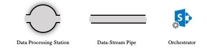
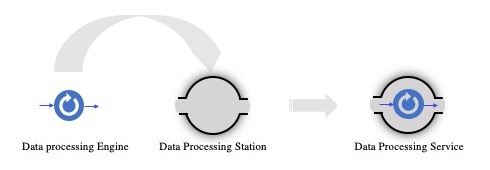
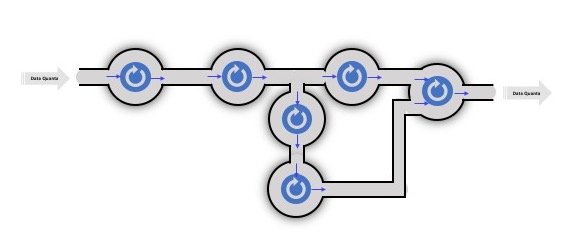

# Documentation

## Welcome!
In a few words CLARA is a data-in-motion platform to build streaming
scientific-data analytics applications. It enables scientist to collect,
process, analyze and act on streaming data-quanta (user defined and framework agnostic)
across data centers and clouds.

CLARA framework presents three core components:
***Data Processing Station*** (we call it a service, which is a container for a user data
processing engine), ***Data-stream Pipe*** (a data bus based on [xMsg](https://claraweb.jlab.org/xmsg)
messaging system, that supports protocols, such as MPI, pub-sub, p2p, inproc, and shared memory), and
***Data-flow Orchestrator*** (process level workflow management systems).

{: .align-center }

The idea is that the stream of data-quanta are
flowing through data processing stations and getting changed/processed
along the line of a flow. Data processing stations are the place where
user data-quanta processing algorithms and programs are dropped in and
presented as data processing CLARA services.

{: .align-center }

Services are reactive computing units. They react on a data-quantum at
the input and present processed data-quantum at the output. So, they are
free of dealing with data stream organization, networking,
data serialization/deserialization, data-quantum transport optimizations, etc.
This makes data processing algorithm development, testing, optimization
and debugging completely independent.
Another important feature of CLARA is that the data stream processing station,
will vertically auto-scale user data processing engine based on the load and/or
user request, freeing user algorithm developers to worry about
creating and managing thread pools, mutex locks and other scaling technical
details.
So, Having variety of services and pipes to connect them together,
CLARA presents a software LEGO system to design and deploy scientific
data processing applications without writing a single line of code.

{: .align-center }

### Get Started
Through this page service engine developers can find the necessary reference materials
to develop service engines in all supported languages.
Visit [Quick Start](quickstart/)
for an introduction to writing services in your preferred language.
Application developers can learn how to use CLARA orchestration layer
to compose services into a streaming data-processing applications.
Visit [Guides](guides/) for more details.
A complete working example to
to develop [multi-lingual application](https://github.com/JeffersonLab/clara-demo)
can be useful for advanced users.

 <!-- ## Supported Languages -->

 <!-- | Java | C++ | Python | -->
 <!-- |:-----|:----|:-------| -->
 <!-- | [Quick Start][jq] | [Quick Start][cq] | [Quick Start][pq] | -->
 <!-- | [Tutorial][jt]    | [Tutorial][ct]    | [Tutorial][pt]    | -->
 <!-- | [Examples][je]    | [Examples][ce]    | [Examples][pe]    | -->
 <!-- | [Reference][jr]   | [Reference][cr]   | [Reference][pr]   | -->
 <!-- {: .doc-lang-table } -->

 <!-- [jq]: quickstart/java.md -->
 <!-- [jt]: tutorials/java.md -->
 <!-- [je]: examples/java.md -->
 <!-- [jr]: /clara/api/java/current/ -->

 <!-- [cq]: quickstart/cpp.md -->
 <!-- [ct]: tutorials/cpp.md -->
 <!-- [ce]: examples/cpp.md -->
 <!-- [cr]: /clara/api/cpp/ -->

 <!-- [pq]: quickstart/python.md -->
 <!-- [pt]: tutorials/python.md -->
 <!-- [pe]: examples/python.md -->
 <!-- [pr]: /clara/api/python/ -->

 <!-- ## Use cases -->

